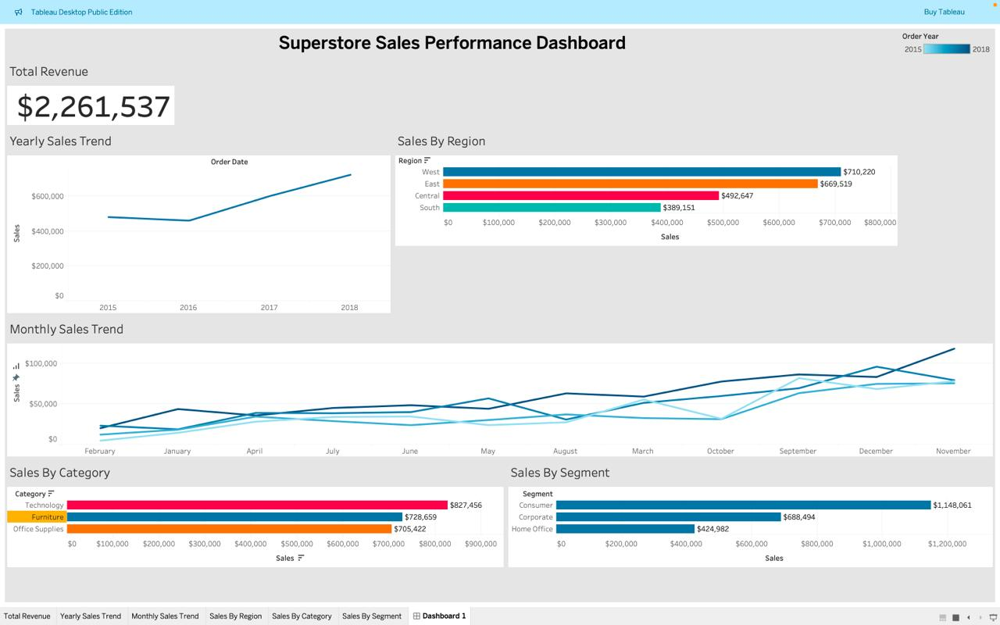

## 📊 Superstore Sales Performance Analysis

## 📌 Project Overview

This project analyzes the Superstore dataset to uncover business insights related to sales performance, customer segments, product categories, and regional trends.

The analysis was performed using Python for data exploration and Tableau for interactive dashboard creation.

---

## 🎯 Business Objectives

- Analyze total revenue and yearly growth trends
- Identify top-performing regions
- Compare sales across product categories
- Understand customer segment contribution
- Examine monthly sales patterns

---

## 🛠 Tools & Technologies Used

- Python (Pandas, Matplotlib)
- Tableau Public
- Jupyter Notebook
- CSV Dataset

---

## 📂 Dataset Source

The dataset used in this project was obtained from Kaggle:

🔗 https://www.kaggle.com/datasets/rohitsahoo/sales-forecasting

The dataset includes:

- Order Date
- Region
- Category
- Segment
- Sales
- Customer Information

---

## 📊 Dashboard Highlights

### 🔹 Total Revenue
Total Revenue: **$2,261,537**

### 🔹 Regional Insights
- West region generated the highest sales
- South region recorded the lowest revenue

### 🔹 Category Performance
- Technology category performed best
- Furniture and Office Supplies followed

### 🔹 Customer Segments
- Consumer segment contributed the highest revenue
- Corporate and Home Office followed

### 🔹 Time Trends
- Sales show steady yearly growth
- Q4 months show noticeable spikes

---

## 📈 Business Insights

This analysis helps businesses:

- Focus marketing on high-performing regions
- Improve inventory planning for peak months
- Target high-value customer segments
- Optimize category-level strategies

---

## 🖼 Dashboard Preview

---

## 🚀 How to View the Dashboard

1. Download the `.twbx` file from this repository
2. Open using Tableau Public Desktop
3. Interact with filters and explore insights

---

Akmal Malik  
Aspiring Data Analyst | BCA Student  
